# RAPIDA – A semi-automated geospatial analysis tool for rapid crisis response.

At it's core,**rapida** is a python library and command line tool built on top of several
curated geospatial datasets associated with specific geospatial risk's exposure components /variables
capable to perform semi-automated assessments (zonal statistics) over a specific area of interest.

Essentially, **rapida** operates with a special folder or project that contains
       
  - specific metadata in json format
  - vector data layers in [GPKG](https://gdal.org/en/stable/drivers/vector/gpkg.html) format
  - raster data in [COG](https://gdal.org/en/stable/drivers/raster/cog.html) format

A typical **rapida** session consists of following steps:

```mermaid
flowchart LR
    
    i([🟢 Init]) --> a([🔐 Auth])
    as{{🔍 Assess?}}
    %% Switch to top-to-bottom (TB) direction for vertical alignment
    subgraph vertical [ ]
        direction TB
        as <-->|🌥️cloud / 🖧remote| db[(🌍 Data)]
    end
    a --> vertical
    vertical --> u{{📤 upload}}
    u{{📤 upload}} --> p{{🌐 publish}}
    
```




## Features 


- [x] fetching/downloading and curating (h3id) administrative boundaries from [OSM](https://wiki.openstreetmap.org/wiki/Key:admin_level) / [OCHA@COD](https://codgis.itos.uga.edu/arcgis/rest/services) sources
- [x] conducting geospatial assessments over and area of interest containing geospatial polygons
  - [x] buildings
  - [x] deprivation/poverty
  - [x] electrical grid
  - [x] GDP
  - [x] land use
  - [x] population
  - [x] roads
- [x] integration with UNDP Azure cloud storage and [UNDP GeoHub](https://geohub.data.undp.org/)
  - [x] concept of project (create, list, delete, upload, download)
- [x] integration with JupyterHub
  - [x] geospatial visualization
  - [x] notebooks
- [x] rich UI/UX 

## Core software components & libs
+ GDAL www.gdal.org
+ rasterio https://github.com/rasterio/rasterio
+ exactextract https://github.com/isciences/exactextract
+ geopandas https://github.com/geopandas/geopandas
+ rich https://github.com/Textualize/rich/tree/master
+ click https://github.com/pallets/click
+ tensorflow https://www.tensorflow.org/

... and others


## Data sources

> [!IMPORTANT]
> **rapida** operates with public datasets. However, some of these datasets rae currently being hosted in
> [GeoHub](https://geohub.data.undp.org/). This is for two main reasons. First, in case a data source is available from 
> one source only it was moved to Geohub to create a backup. Second, some data sources like population have been also 
> curated and optimized as to facilitate the assessment process.

**rapida** is about conducting geospatial assessments on  geo layers. Various properties/aspects of the layers are 
assessed or evaluated over an area of interest. The variables can be grouped into high level components that correspond
to major areas of evaluation in the context of crises like : population, built environment (buildings, roads), natural
environment (land use/cover, livestock), socio-economical environment (GDP, relative wealth index, deprivation,HDI).


<details>

<summary>
 🧑‍🤝‍🧑 Population
</summary>

Sourced from [WorldPop](https://www.worldpop.org/) project, the components provides country based population data in 
raster format. The constrained (conditioned by buildings), UN adjusted version was selected as it was considered the best
match. As the most recent population dataset was generated for 2020 rapida is forecasting the 2020 population using 
national data from World Bank that is available for several year in the past in respect to 2020. 
From there a coefficient is computed by dividing the target or requested year (ex 2025) to 2020 and the population
statistics computed for 2020 or base year are multiplied with this coefficient.
</details>


 
<details>

<summary style='border-bottom:px solid gray'>
🏙️ Built environment
</summary>

The built environment refers to the human-made surroundings that provide the setting for human activity. This includes 
all physical spaces and infrastructure constructed or significantly modified by people.


1. Buildings
---
This dataset merges Google's V3 Open Buildings, Microsoft's GlobalMLFootprints, and OpenStreetMap building footprints. 
It contains 2,705,459,584 footprints and is divided into 200 partitions. Each footprint is labelled with its respective 
source, either Google, Microsoft, or OpenStreetMap. It can be accessed in cloud-native geospatial formats such as 
GeoParquet, FlatGeobuf and PMTiles.

So far two spatial variables have been defined: the **number of buildings** per polygon to assess and the cumulative
**area of buildings** per polygon to assess.

2. Electrical grid
---

This dataset provides a global-scale, high-resolution predictive map of medium- and low-voltage electricity distribution
networks. Developed using open-source geospatial data, satellite imagery, and machine learning models, it fills critical
data gaps in power infrastructure—particularly in underserved or data-poor regions. The dataset supports energy access 
planning, infrastructure development, and policy-making.


The distribution network layout was estimated using predictive modeling based on spatial features such as 
**population density, proximity to existing infrastructure, land use, and OpenStreetMap data**. 
Models were trained and validated using empirical data from 14 countries, achieving ~75% accuracy. 
The resulting dataset includes both observed and predicted network lines and is suitable for global energy planning and 
accessibility/assessment  studies.


3. Roads
---

The GRIP dataset provides a globally harmonized vector map of road infrastructure, integrating over 21 million kilometers
of roads from a variety of open and commercial sources. Designed to support global-scale environmental and accessibility modeling, 
the dataset offers standardized road classifications and extensive geographic coverage, especially in previously underrepresented regions.

Road data were compiled from national, regional, and global datasets, harmonized into a unified schema, and cleaned for 
spatial consistency. Next, they were classified into five standardized types (e.g., highways, primary, secondary, local, tracks) 
and validated using satellite imagery and supplementary datasets. The dataset is suitable for applications 
targeting land-use modeling, biodiversity impact assessments, and sustainable development planning.


</details>


 
<details>

<summary>
🌾 Landuse
</summary>

While conceptually simple, this layer features several characteristics that make its usage and applications
difficult to interpret. Typically, land use layer is produced using  middle to high resolution 
satellite imagery that is generated by taking snapshots of earth at particular instances of space and time. Next, imagery tiles
that fulfill specific requirements are mosaicked together into a seamless, spatially contiguous dataset.
This brings a large amount of heterogenity into the processing and interpretation of land use layer because various 
pixels that compose it have been acquired at and different times and under different conditions.

In the context of crisis resilience, the timing of satellite image acquisition is critical. Imagery captured before, after, 
or both before and after a specific event is typically used to assess conditions on the ground. In case of land use layer 
this is problematic because neighbour location could be acquired at different instances of time and conditions and bear little resemblance or
positive spatial auto-correlation. 
As a result, **rapida** employes a different approach. Cloud accessible Sentinel 2 L1C imagery, available at global level
is was fed into the [Google dynamic world model](https://github.com/google/dynamicworld) to predict land use in close to real time
for every image selected in a specific time interval with less than 5% cloud coverage. 

The last step that is not yet implemented is to generate the cloud prediction  and use the layer to mask/out filter
cloudy/snowy pixels.

> [!IMPORTANT]
> Predicting land use in close to real time is a computationally demanding task and should be treated with care


</details>


<details>
<summary>
💰 Socio-economic environment
</summary>

The socio-economic environment refers to the social and economic conditions that influence and shape the lives, 
behaviors, and development outcomes of individuals, communities, and societies.

1. Deprivation
---
he Global Gridded Relative Deprivation Index (GRDI), Version 1, provides a detailed picture of relative deprivation and 
poverty worldwide, mapped at a high spatial resolution of approximately 1 km². The index ranges from 0 (least deprived) 
to 100 (most deprived). It is built using a combination of demographic and satellite data, carefully processed to ensure
consistency across different regions. To create GRDI, six key factors were selected to represent different aspects of 
deprivation, such as economic activity, child mortality, and human development. The dataset covers the entire globe, 
integrating the best available data at either a fine-scale grid level or broader administrative boundaries.

GRDI combines six key indicators to assess deprivation levels:

1. Built-up Area Ratio (BUILT): Measures the proportion of land covered by buildings compared to open land. Lower values
    indicate higher deprivation, as rural areas tend to have fewer economic opportunities.¹
2. Child Dependency Ratio (CDR): The number of children (aged 0–14) per 100 working-age adults (15–64). 
   A higher ratio suggests higher deprivation due to greater economic strain on households.²
3. Infant Mortality Rate (IMR): The number of infant deaths (under one year old) per 1,000 live births. 
   A higher IMR indicates poorer health conditions and higher deprivation.
4. Subnational Human Development Index (SHDI): A local version of the Human Development Index (HDI), considering education,
health, and living standards. Lower SHDI scores reflect higher deprivation.³
5. Nighttime Lights (VNL, 2020): Measures light intensity at night, which is often linked to economic activity and infrastructure. 
   Areas with less artificial light tend to have higher deprivation.⁴
6. Nighttime Lights Trend (VNL Slope, 2012–2020): Tracks changes in nighttime lights over time. 
   A decline in brightness suggests worsening deprivation, while an increase indicates economic growth.

The dataset can be used to:
- identify areas with high deprivation to guide poverty reduction efforts
- map socioeconomic inequalities at fine spatial scales
- support policy decisions and resource allocation for targeted interventions


2. Relative Wealth Index
---
The Meta Relative Wealth Index is a high-resolution, machine learning–derived proxy for household wealth, developed by 
Meta’s Data for Good initiative. It estimates relative wealth scores at a 2.4 km grid level across low- and middle-income 
countries by analyzing de-identified Facebook connectivity data and satellite imagery. 
The RWI enables fine-scale economic analysis in data-scarce regions and supports humanitarian, development, and policy interventions.


3. GDP
___
This dataset provides annual, global gridded estimates of Gross Domestic Product (GDP) at 0.1° spatial resolution (~10 km at the equator)
from 2015 to 2100, fully aligned with the five Shared Socioeconomic Pathways (SSPs). 
It offers GDP values in both constant 2015 U.S. dollars and purchasing power parity (PPP), enabling spatially explicit 
long-term economic modeling under diverse socioeconomic scenarios.
The dataset was up-sampled to 1km resolution and reprojected to [EPSG:3857](https://epsg.io/3857) to facilitate web usage.

To construct a spatially explicit and globally consistent GDP dataset aligned with the Shared Socioeconomic Pathways (SSPs), 
the authors began by collecting national-level GDP projections for each of the five SSP scenarios. These projections, 
expressed in both constant 2015 U.S. dollars and purchasing power parity (PPP), were sourced from authoritative institutions 
such as the Organisation for Economic Co-operation and Development (OECD) and the International Institute for 
Applied Systems Analysis (IIASA). 

Next, population data at 0.1° resolution were obtained from the SSP Public Database. 
These gridded population distributions were used as the basis for disaggregating national GDP values. 
The key assumption underpinning the downscaling process was that GDP per capita remains spatially uniform within each 
country for a given year. Based on this, national GDP totals were allocated across grid cells in direct proportion to the
local population count. This method produced a high-resolution, annual global GDP dataset spanning from 2015 to 2100, 
consistent with the spatial and temporal dynamics of each SSP scenario. 
The resulting data are well-suited for use in integrated assessment models, climate impact studies, land-use modeling, and other applications requiring detailed socioeconomic projections.

</details>


## Installation

Install the project with dependencies to virtual environment as below.

```shell
pipenv run pip install -e .
```

If you want to install optional dependencies for testing, execute the following command.

```shell
pipenv run pip install .[dev]
```

To uninstall the project from Python environment, execute the following command.

```shell
pipenv run pip uninstall geo-cb-surge
```

## Usage

Then, run the below command to show help menu.

```shell
pipenv run rapida --help
```

## Setup

To access blob storage in Azure, each user must have a role of `Storage Blob Data Contributor`.

```shell
pipenv run rapida init
```

## Admin

`admin` command provides functionality to retrieve admin data for passed bounding bbox from either OpenStreetMap or OCHA.

- OSM

```shell
pipenv run rapida admin osm --help
```

- ocha

```shell
pipenv run rapida admin ocha --help
```

## Run test

Each `rapida`'s modules has its own test suite which can be ran independently

```shell
make test
```

before running the above command, please use `devcontainer` or `make shell` to enter to docker container first.

## Using docker

### build docker-image

```shell
make build
```

If you would like to build image for production, execute the below command

```shell
PRODUCTION=true make build
```

### destroy docker container

```shell
make down
```

### enter to Docker container

```shell
make shell
pipenv run rapida --help # run CLI in shell on docker container
```

## Authenticate on local machine

You can login to UNDP account in local machine, then mount auth token information to the Docker. Thus, session class will use your local authentication info for the tool.

Firstly, copy `env.example` to create `.env` locally.

Set the following environmental variables.

```shell
TENANT_ID=
CLIENT_ID=
```

`CLIENT_ID` (Use it from Microsoft Azure CLI) can be found [here](https://learn.microsoft.com/en-us/troubleshoot/entra/entra-id/governance/verify-first-party-apps-sign-in#application-ids-of-commonly-used-microsoft-applications).
`TENANT_ID` is for UNDP. Please ask administrator for it.

create new virtual environment in local machine (eg, pipenv), install the following dependencies.

```shell
pip install msal azure-core playwright azure-storage-blob click
```

Execute below py file independently to authenticate in local machine.

```shell
pipenv run rapida auth
```

`rapida auth --help` to show usage.

Use `-c {cache_dir}` to change folder path to store a token file.

The script will create token file at `~/.rapida`.

Open `docker-compose.yaml`. Uncomment the following code to mount json file from your local to the container.

You may need to adjust file path according to your environment settings.

```yaml
volume:
  - ~/.rapida:/root/.rapida
```

Using the below command to setup rapida tool. If it shows `authentication successful` in the log, it uses credential from your local machine directly.

```shell
rapida init
```