# RAPIDA – A semi-automated geospatial analysis tool for rapid crisis response.

At it's core,**rapida** is a python library and command line tool built on top of several
curated geospatial datasets associated with specific geospatial risk's exposure components /variables
capable to perform semi-automated assessments (zonal statistics) over a specific area of interest.

Essentially, **rapida** operates with a special folder or project that contains
       
  - specific metadata in json format
  - vector data layers in [GPKG](https://gdal.org/en/stable/drivers/vector/gpkg.html) format
  - raster data in [COG](https://gdal.org/en/stable/drivers/raster/cog.html) format

A typical **rapida** session consists of following steps:

```mermaid
flowchart LR
    
    i([🟢 Init]) --> a([🔐 Auth])
    as{{🔍 Assess?}}
    %% Switch to top-to-bottom (TB) direction for vertical alignment
    subgraph vertical [ ]
        direction TB
        as <-->|🌥️cloud / 🖧remote| db[(🌍 Data)]
    end
    a --> vertical
    vertical --> u{{📤 upload}}
   
   
    

```




## Features 


- [x] fetching/downloading and curating (h3id) administrative boundaries from [OSM](https://wiki.openstreetmap.org/wiki/Key:admin_level) / [OCHA@COD](https://codgis.itos.uga.edu/arcgis/rest/services) sources
- [x] conducting geospatial assessments over and area of interest containing geospatial polygons
  - [x] buildings
  - [x] deprivation/poverty
  - [x] electrical grid
  - [x] GDP
  - [x] land use
  - [x] population
  - [x] roads
- [x] integration with UNDP Azure cloud storage and [UNDP GeoHub](https://geohub.data.undp.org/)
  - [x] concept of project (create, list, delete, upload, download)
- [x] integration with JupyterHub
  - [x] geospatial visualization
  - [x] notebooks
- [x] rich UI/UX 

## Core software components & libs
+ GDAL www.gdal.org
+ rasterio https://github.com/rasterio/rasterio
+ exactextract https://github.com/isciences/exactextract
+ geopandas https://github.com/geopandas/geopandas
+ rich https://github.com/Textualize/rich/tree/master
+ click https://github.com/pallets/click
+ tensorflow https://www.tensorflow.org/

... and others


## Data

> **rapida** operates

## Installation

Install the project with dependencies to virtual environment as below.

```shell
pipenv run pip install -e .
```

If you want to install optional dependencies for testing, execute the following command.

```shell
pipenv run pip install .[dev]
```

To uninstall the project from Python environment, execute the following command.

```shell
pipenv run pip uninstall geo-cb-surge
```

## Usage

Then, run the below command to show help menu.

```shell
pipenv run rapida --help
```

## Setup

To access blob storage in Azure, each user must have a role of `Storage Blob Data Contributor`.

```shell
pipenv run rapida init
```

## Admin

`admin` command provides functionality to retrieve admin data for passed bounding bbox from either OpenStreetMap or OCHA.

- OSM

```shell
pipenv run rapida admin osm --help
```

- ocha

```shell
pipenv run rapida admin ocha --help
```

## Run test

Each `rapida`'s modules has its own test suite which can be ran independently

```shell
make test
```

before running the above command, please use `devcontainer` or `make shell` to enter to docker container first.

## Using docker

### build docker-image

```shell
make build
```

If you would like to build image for production, execute the below command

```shell
PRODUCTION=true make build
```

### destroy docker container

```shell
make down
```

### enter to Docker container

```shell
make shell
pipenv run rapida --help # run CLI in shell on docker container
```

## Authenticate on local machine

You can login to UNDP account in local machine, then mount auth token information to the Docker. Thus, session class will use your local authentication info for the tool.

Firstly, copy `env.example` to create `.env` locally.

Set the following environmental variables.

```shell
TENANT_ID=
CLIENT_ID=
```

`CLIENT_ID` (Use it from Microsoft Azure CLI) can be found [here](https://learn.microsoft.com/en-us/troubleshoot/entra/entra-id/governance/verify-first-party-apps-sign-in#application-ids-of-commonly-used-microsoft-applications).
`TENANT_ID` is for UNDP. Please ask administrator for it.

create new virtual environment in local machine (eg, pipenv), install the following dependencies.

```shell
pip install msal azure-core playwright azure-storage-blob click
```

Execute below py file independently to authenticate in local machine.

```shell
pipenv run rapida auth
```

`rapida auth --help` to show usage.

Use `-c {cache_dir}` to change folder path to store a token file.

The script will create token file at `~/.rapida`.

Open `docker-compose.yaml`. Uncomment the following code to mount json file from your local to the container.

You may need to adjust file path according to your environment settings.

```yaml
volume:
  - ~/.rapida:/root/.rapida
```

Using the below command to setup rapida tool. If it shows `authentication successful` in the log, it uses credential from your local machine directly.

```shell
rapida init
```